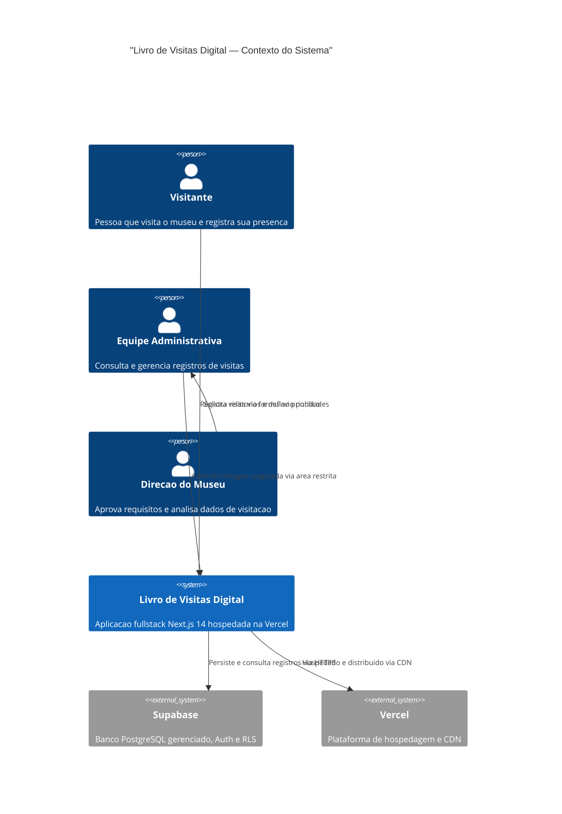

# C4 — Nível 1: Contexto

```mermaid
C4Context
  title "Livro de Visitas Digital — Contexto do Sistema"

  Person(visitante, "Visitante", "Pessoa que visita o museu e registra sua presenca")
  Person(admin, "Equipe Administrativa", "Consulta e gerencia registros de visitas")
  Person(direcao, "Direcao do Museu", "Aprova requisitos e analisa dados de visitacao")

  System(livro_visitas, "Livro de Visitas Digital", "Aplicacao fullstack Next.js 14 hospedada na Vercel")

  System_Ext(supabase, "Supabase", "Banco PostgreSQL gerenciado, Auth e RLS")
  System_Ext(vercel, "Vercel", "Plataforma de hospedagem e CDN")

  Rel(visitante, livro_visitas, "Registra visita via formulario publico")
  Rel(admin, livro_visitas, "Consulta listagem paginada via area restrita")
  Rel(direcao, admin, "Solicita relatorios e define prioridades")
  Rel(livro_visitas, supabase, "Persiste e consulta registros via HTTPS")
  Rel(livro_visitas, vercel, "Hospedado e distribuido via CDN")
```
