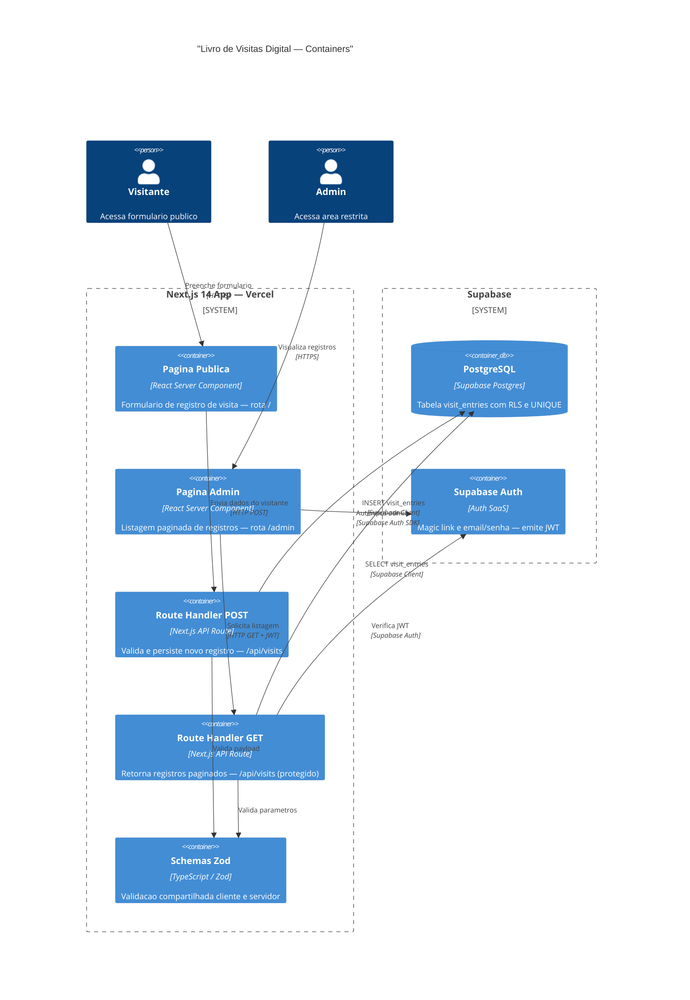

# C4 — Nível 2: Container

```mermaid
C4Container
  title "Livro de Visitas Digital — Containers"

  Person(visitante, "Visitante", "Acessa formulario publico")
  Person(admin, "Admin", "Acessa area restrita")

  System_Boundary(app, "Next.js 14 App — Vercel") {
    Container(frontend_pub, "Pagina Publica", "React Server Component", "Formulario de registro de visita — rota /")
    Container(frontend_adm, "Pagina Admin", "React Server Component", "Listagem paginada de registros — rota /admin")
    Container(api_post, "Route Handler POST", "Next.js API Route", "Valida e persiste novo registro — /api/visits")
    Container(api_get, "Route Handler GET", "Next.js API Route", "Retorna registros paginados — /api/visits (protegido)")
    Container(zod_schema, "Schemas Zod", "TypeScript / Zod", "Validacao compartilhada cliente e servidor")
  }

  System_Boundary(supa, "Supabase") {
    ContainerDb(db, "PostgreSQL", "Supabase Postgres", "Tabela visit_entries com RLS e UNIQUE")
    Container(auth, "Supabase Auth", "Auth SaaS", "Magic link e email/senha — emite JWT")
  }

  Rel(visitante, frontend_pub, "Preenche formulario", "HTTPS")
  Rel(admin, frontend_adm, "Visualiza registros", "HTTPS")
  Rel(frontend_pub, api_post, "Envia dados do visitante", "HTTP POST")
  Rel(frontend_adm, api_get, "Solicita listagem", "HTTP GET + JWT")
  Rel(api_post, zod_schema, "Valida payload")
  Rel(api_get, zod_schema, "Valida parametros")
  Rel(api_post, db, "INSERT visit_entries", "Supabase Client")
  Rel(api_get, db, "SELECT visit_entries", "Supabase Client")
  Rel(frontend_adm, auth, "Autentica admin", "Supabase Auth SDK")
  Rel(api_get, auth, "Verifica JWT", "Supabase Auth")
```
