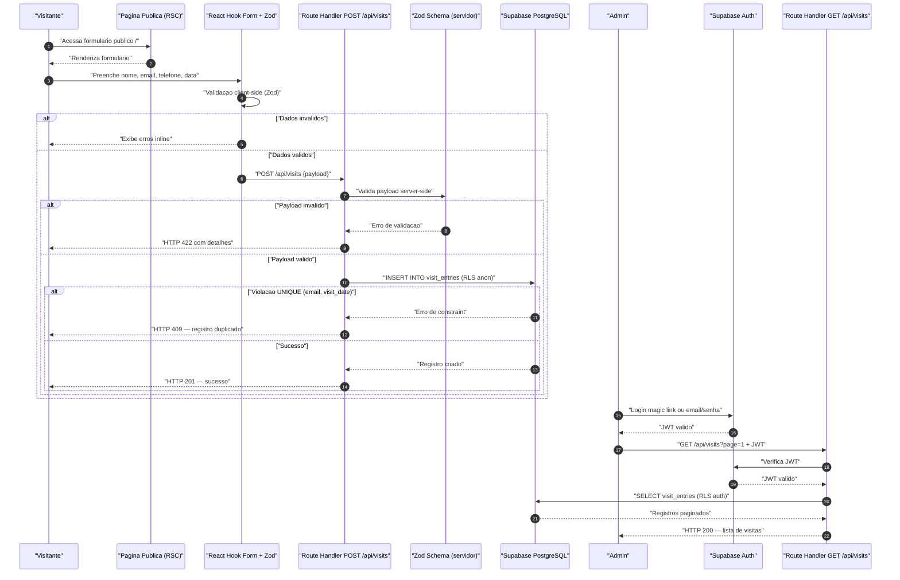

# Diagrama de Sequência — Registro de Visita e Consulta Admin

```mermaid
sequenceDiagram
  autonumber
  participant V as "Visitante"
  participant FE as "Pagina Publica (RSC)"
  participant RHF as "React Hook Form + Zod"
  participant API as "Route Handler POST /api/visits"
  participant ZOD as "Zod Schema (servidor)"
  participant SB as "Supabase PostgreSQL"
  participant ADM as "Admin"
  participant AUTH as "Supabase Auth"
  participant APIG as "Route Handler GET /api/visits"

  V->>FE: "Acessa formulario publico /"
  FE-->>V: "Renderiza formulario"
  V->>RHF: "Preenche nome, email, telefone, data"
  RHF->>RHF: "Validacao client-side (Zod)"
  alt "Dados invalidos"
    RHF-->>V: "Exibe erros inline"
  else "Dados validos"
    RHF->>API: "POST /api/visits {payload}"
    API->>ZOD: "Valida payload server-side"
    alt "Payload invalido"
      ZOD-->>API: "Erro de validacao"
      API-->>V: "HTTP 422 com detalhes"
    else "Payload valido"
      API->>SB: "INSERT INTO visit_entries (RLS anon)"
      alt "Violacao UNIQUE (email, visit_date)"
        SB-->>API: "Erro de constraint"
        API-->>V: "HTTP 409 — registro duplicado"
      else "Sucesso"
        SB-->>API: "Registro criado"
        API-->>V: "HTTP 201 — sucesso"
      end
    end
  end

  ADM->>AUTH: "Login magic link ou email/senha"
  AUTH-->>ADM: "JWT valido"
  ADM->>APIG: "GET /api/visits?page=1 + JWT"
  APIG->>AUTH: "Verifica JWT"
  AUTH-->>APIG: "JWT valido"
  APIG->>SB: "SELECT visit_entries (RLS auth)"
  SB-->>APIG: "Registros paginados"
  APIG-->>ADM: "HTTP 200 — lista de visitas"
```
